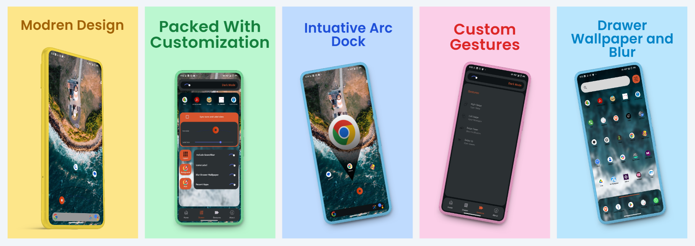
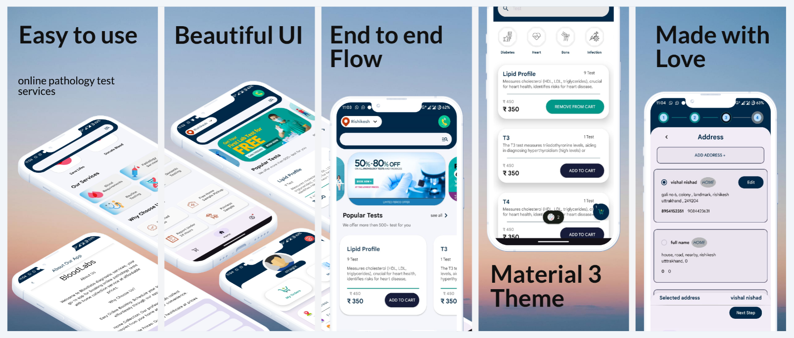

<h2 align="left">Hi 👋! My name is Vishal and I'm a Android and Web developer , from .... Dev Bhoomi Uttrakhand</h2>

###

  
  
  
  
  
  
  
  
  
  
  
  
  
  
  
  
  
  
  
  
  
  
  
  
  
  
  
  
  
  
  
  
  
  
  

###

  

###

Hello World!!

###

 

  
  

###

  

###

 

  
  
  
  
  

<!-- ABOUT THE PROJECT -->
About The Project
<h2 align="center">Arc Launcher</h2>

 Transforms the standard Android experience into a futuristic, exciting interface, enhancing user interaction and making everyday Android phones feel fresh and innovative.

Technologies:

    Android Studio
    MVVM
    Firebase
    Room

Roles:

    Full-Stack Application Development
    Deployment

<h2 align="center">Blood labs</h2>

 Marketplace for sample collection, offering home collection services for various pathology tests. Designed for convenience with quick booking steps and price checks.

Technologies:

    Android Studio
    Firebase
    MVVM Architecture
    Paging Library
    Compose UI
    Room
    Figma

Roles:

  
    Full-Stack Application Development
    Deployment

(<a href="#readme-top">back to top</a>)

<h2 align="center">Virtual Gamepad with WebSocket Server</h2>

A Virtual Gamepad for macOS and Android that enables seamless gameplay for emulator games. It simulates keyboard and mouse inputs through real-time key mappings via WebSocket communication.
Features
Cross-Platform: Compatible with macOS and Android.
Key Mapping: Supports custom keyboard and mouse actions.
WebSocket Protocol: Low-latency, real-time input handling.
JSON Messaging: Simple and extensible input format.
Technologies
Python, Jetpack Compose, Android Studio
Xcode, Swift, Pynput
Roles
Full-Stack Development: Server and client-side implementation.
Platform Integration: macOS and Android compatibility.

(<a href="https://github.com/Xemb0/WxGamepadFiles/tree/main">Download Files</a>)

